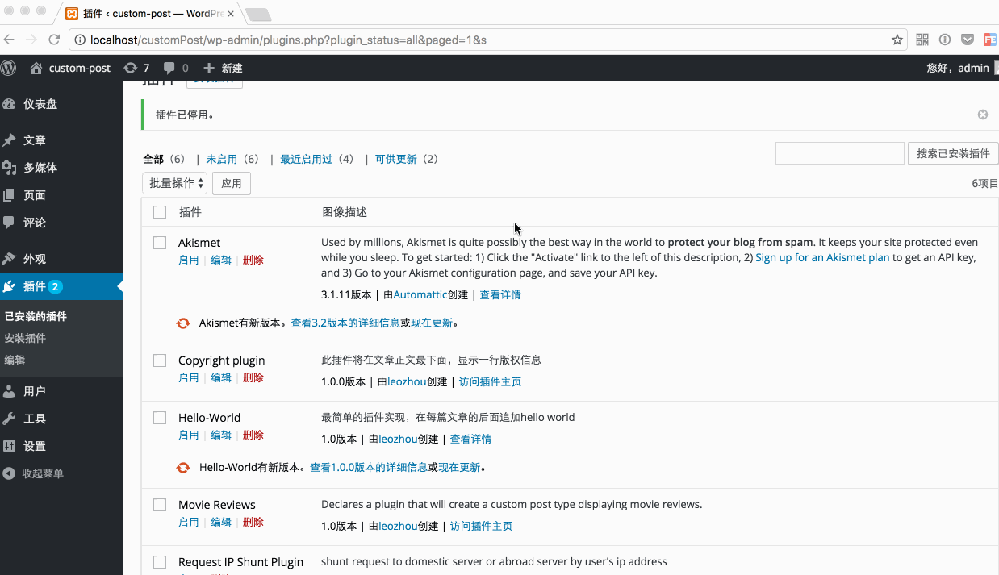

# Request-IP-Shunt-Plugin
### Description

A request IP shunt plugin for wordpress.It can help you to shunt request by user's ip address to domestic url or abroad url ,but using the same accessed url.

For example, you have two servers to provide the same content, but one is returning content to users in the domestic, and the other one is returning content to users abroad. And the use the same url to visit. The plugin will generate a url as A , and set two urls as B and C, then, if visit the url A, if you are in the domestic, it will forward to url B. otherwise, it will forward to url C.

### Sample

